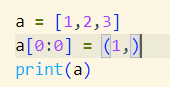

**以后就在这写笔记了，word版本算是老版本**
1.kwargs,args参数的使用，举个示例如下
```
def main(arg,*args,**kwargs):
    print(arg)
    print(args)
    print(kwargs)
main(1,2,2,2,2,2,2,Student = "学生", Teacher = "老师")
```
输出结果为
```
1
(2, 2, 2, 2, 2, 2)
{'Student': '学生', 'Teacher': '老师'}
```
可见，
args**是把不确定的参数变成元组输出**
kwargs**是把不确定的键值对变成字典输出**



非常good！！！插入数字的时候使用这种方法啦~