##**1.抽象数据结构**
<<可以理解为，类似于向量，列表那种有操作方法的，叫做抽象数据结构

##**2.数据结构**
<<通俗来讲的话，数据结构可以说是int，double，数据类型

*看图！*
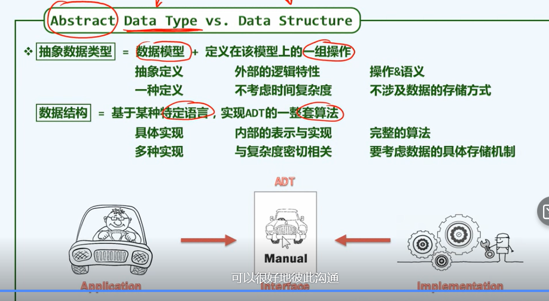

##**3.数组的定义**
可以看这张图
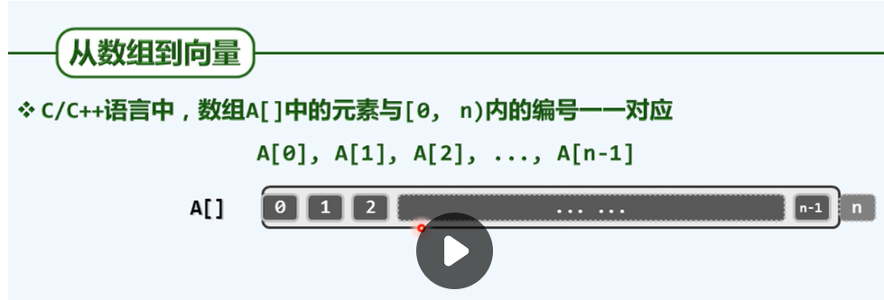
数组就是以一个条的形式，等单位的存储数据

*最后一位作为“哨兵”，实际上不存在的第n位元素，以此来理解算法*
##**4.复杂度**
O(1)复杂度：没有转向（循环、递归、分支）的算法
但也不一定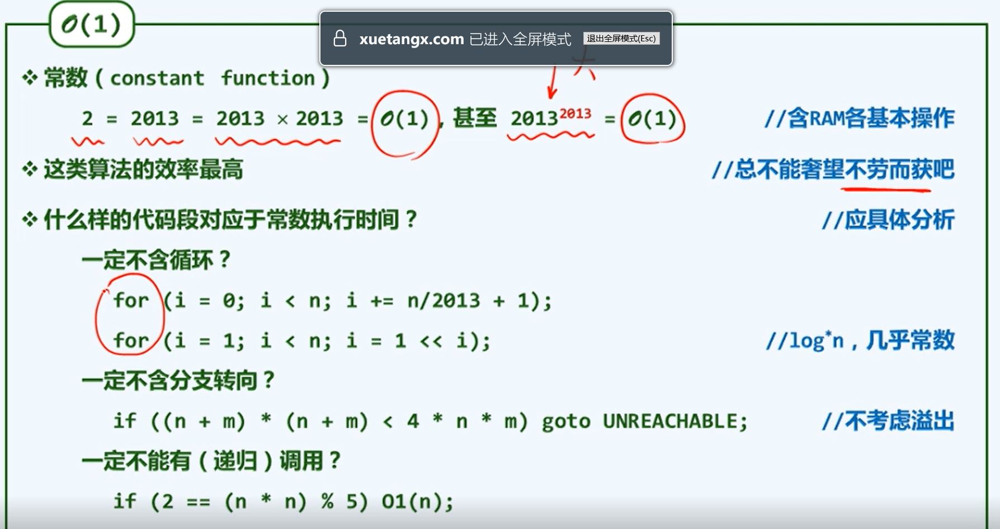
O(logn)复杂度:*该类算法非常有效！*
底数是无所谓的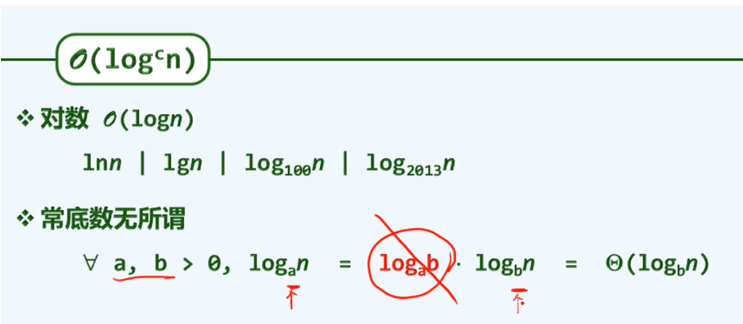
O(n**c)复杂度：多项式复杂度
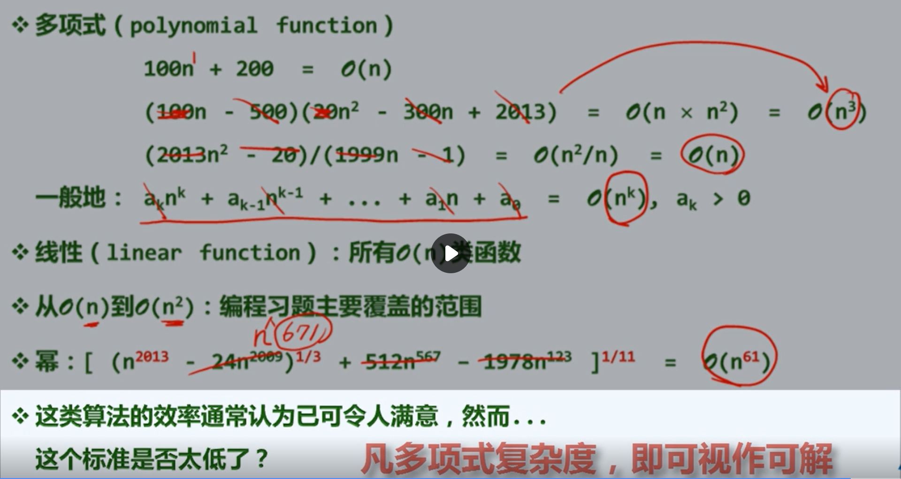
#凡多项式复杂度，就可视作可解
O(2**n):指数复杂度
这类算法的计算成本增长极快，通常认为是不可忍受的
##设计难度上，指数复杂度的算法设计较多项式复杂度来说比较容

循环减半(问题规模缩小了一半)的程序复杂度为o(logn)
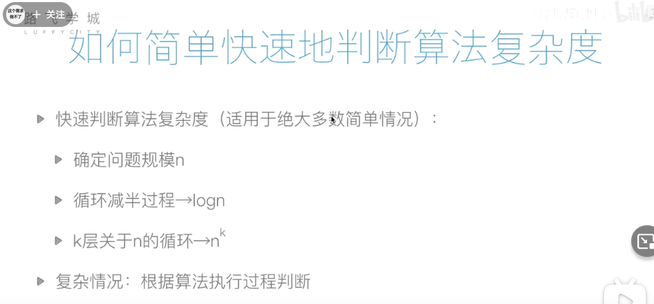

空间复杂度：评估算法内存占用大小（时间比空间重要）
“空间换时间”原则，速度越快越好
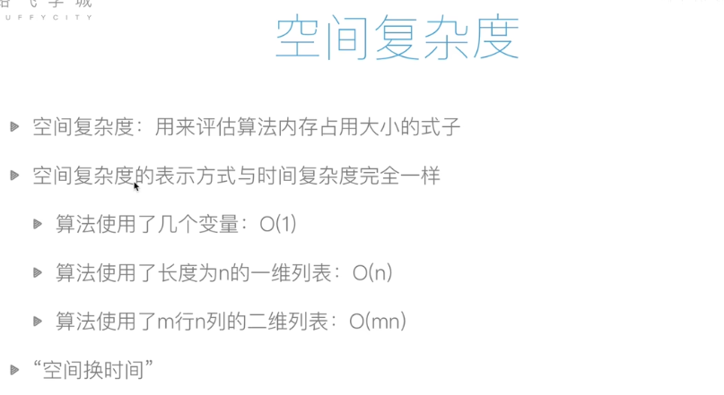

递归：递归具有两个特点
```
·调用自身
·结束条件
```
!!!
*这似乎是个图标符号*
关于递归的顶级理解
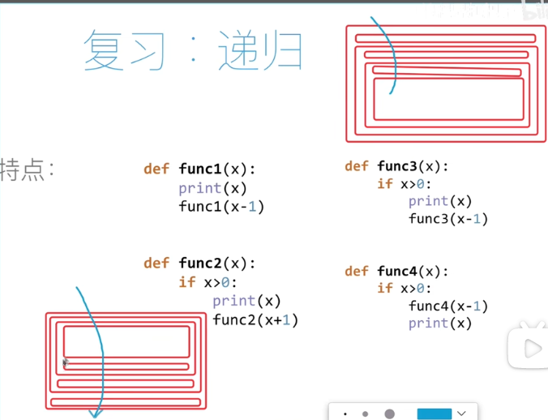
上面是func3的图
下面是func4的图
函数的运行都是从上往下
func3的结果是 3 2 1 
func4的结果是 1 2 3 
讲的很好！

!!!
总结一下汉诺塔问题
我的代码复现：(始终着眼对n-1的处理)
```
def hanoi(n,a,b,c):
    if n > 0:
        hanoi(n-1,a,c,b)
        print('move from {} to {}'.format(a,c))#大盘子，可以抽象到第一步
        hanoi(n-1,b,a,c)
print(hanoi(3,'A','B','C'))
```
我原来是怎么做的呢？
```
def hanoi(n, a, b, c):
    #n 圆盘个数
    #a 初始的桩
    #b 经过的桩
    #c 最后到的桩
    if n > 0 :
        #首先把n-1个圆盘从a经过c移动到b,调用自己
        hanoi(n-1, a, c, b)
        print('move from {} to {}'.format(a,b))
        #再把第1个圆盘从a移到c
        print('move from {} to {}'.format(a,c))
        #最后把n-1个经过a移动到c
        hanoi(n-1, b, a, c)
        print('move from {} to {}'.format(b,c))

print(hanoi(3,'A','B','C'))
```
>>有点搞笑哈哈
>>
错误出在第二步，无需对第一个盘子进行任何操作
**要知道的是，递归其实就是一种数学归纳法，不过是从n到1进行归纳
做数学归纳，其实只需关心的是“n-1”**
数学归纳一般适用于整体隔离分析的问题，把n化成n和n-1两个部分来分析

!!!
查找问题 
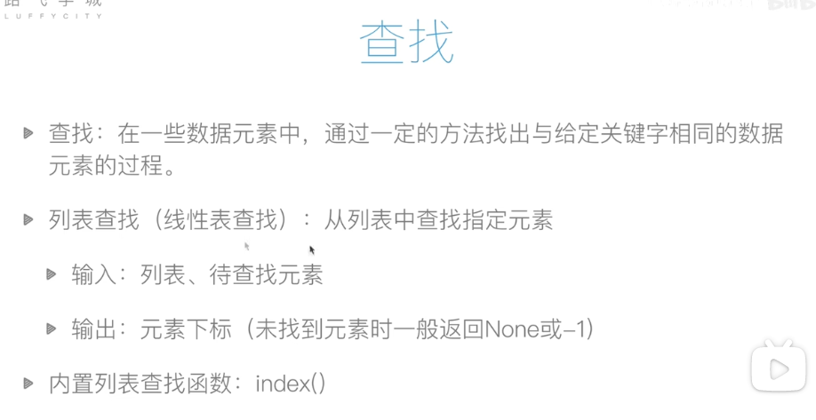
**顺序查找**
```
从列表第一个元素开始，
顺序进行搜索，
直到找到元素或
搜索到列表最后一个元素
```
代码实现如下
```
def linear_search(li, val):
    for ind, v in enumerate(i):
        if v == val:
            return ind
    else:
        return None
``` 
时间复杂度为O(n)
(没有循环减半过程，最多走n步)

**二分查找（折半查找）**(只能用于有序序列)
```
从有序列表的初始候选区域li[0:n]开始，通过对待查找的值与候选区中间值的比较，可以使候选区减少一半
```
代码实现
```
def binary_search(li, val):
    left, right = 0, len(li)-1
    while(left <= right):
        mid = (left + right) // 2
        if li[mid] == val:
            return mid
        elif li[mid] < val:
            left = mid + 1
        else:
            right = mid - 1
    else:
        return None 
```
时间复杂度：O(logn)

!!!
**排序**
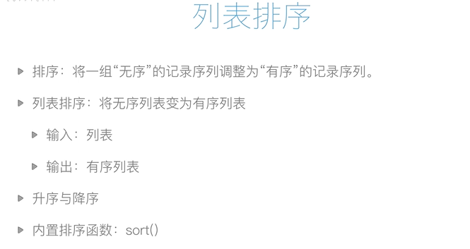
常见的排序算法

#1冒泡排序(Bubble Sort)
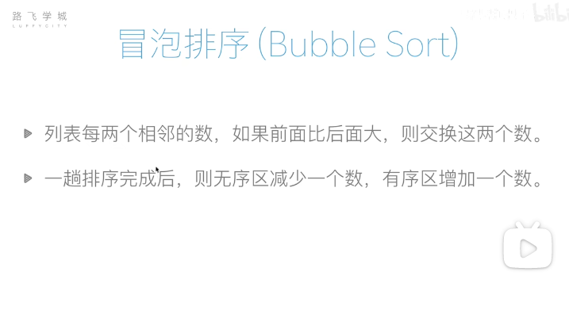
冒泡排序的示例图
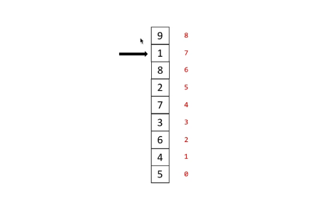
可以发现，“冒泡”是此类排序方法的一个形象表示，越往上泡泡越大
然后，这里需要注意的是冒泡的次数为总数-1次，因为指针指到最后一个元素的时候不再需要冒泡了
>>我自己写的冒泡！！！成功啦！！！！哇哈哈哈
自我总结：冒泡的关键在于，趟数，以及无序有序区间的理解。因为指针到最后一位无需再遍历，所以只会n-1次。而无序有序的理解呢，
**进入有序区的，就不需要再遍历了，而进入有序区的数字是多少？就是i，总共遍历的次数**
*也可以换一个角度来理解，即双指针。*这个仍需要思考，并不是很完善
头指针是小，
尾指针是大，
当尾指针完成遍历的时候，就完成了排序
而头指针负责交换元素等工作，而且头指针只能在[列表开头，头指针位置)这个区间内移动。
头指针长度为n，尾指针长度为i
总长度为n
所以可得总共遍历次数为n-i-1（当头=尾时候不需要遍历了）
```
def bublesort(lst):
    for i in range(len(lst)-1): #一共n-1趟
        for j in range(len(lst)-1-i):
            if lst[j] > lst[j+1]:
                lst[j], lst[j+1] = lst[j+1], lst[j]
    return lst

alist = [4,5,6,1,2,7,9]
new = bublesort(alist)
print(new)
```
答案基本差不多
时间复杂度是O(n**2)
**冒泡排序还有个可以改进的地方**
```
def bublesort(lst):
    for i in range(len(lst)-1): #一共n-1趟
        exchange = False #此处进行标记，如果没有交换的话就直接return列表
        for j in range(len(lst)-1-i):
            if lst[j] > lst[j+1]:
                lst[j], lst[j+1] = lst[j+1], lst[j]
        #print(lst)
        if not exchange:#注意这个用法，就是布尔表达式，意思是如果exchange不是True
            return lst
    return lst

alist = [4,5,6,1,2,7,9]
new = bublesort(alist)
print(new)
```

#2选择排序
>>复习一下pop和remove的用法区别：
pop()需要索引作为参数;
remove()需要具体值作为参数

插入排序的简单思路：遍历一遍列表，找出第一小的值，遍历二遍列表，找出第二小的值...
如此往复
那么可以得到思路简单、操作麻烦一点的做法如下:
*上面是我写的，下面是教程写的*
```
#这里是较为复杂一点的选择排序
def select1(alist):
    #创建新列表用于储存值  
    newone = []
    for i in range(len(alist)):
        #思路：弹出最小值的索引-添加入新列表-返回
        newone.append(alist.pop(alist.index(min(alist))))
    return newone
#注意，写算法的时候最好不用内置函数哦(index等)
def select2(alist):
    newone = []
    for i in range(len(alist)):
        for j in alist:
            newval = min(alist)
            newone.append(newval)
            alist.remove(newval)     #使用remove索引会发生变化，不好
    return newone
```
select2算法有诸多缺陷，比如
1.相比于冒泡排序（原地排序，未占用多余的空间），这个写法占用了一段重复的空间
2.复杂度问题。min()的复杂度为O(n),remove()的复杂度又为O(n)，所以导致整体算法的复杂度为O(n**2)
注意，是n * (n + n)
**优化过后的选择排序代码**
```
def select_sort3(alist):
    for i in range(len(alist) - 1): #同冒泡排序的方法，最后一位不需要遍历
        min_loc = i
        for j in range(i + 1, len(alist) - 1):
            if alist[j] < alist[min_loc]:
                min_loc = j
        alist[i], alist[min_loc] = alist[min_loc], alist[i] #往有序区添加元素，宏观来看可以视作是往列表最前面添加元素
    return alist
```
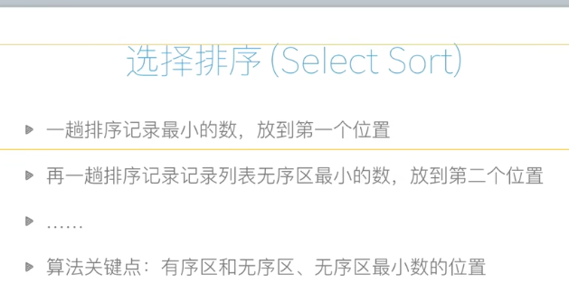
另一个理解角度：
递归
```
我用递归的方式来解释一下
f(x)代表第1～x小的数字
是最小的x的数字 f(0)为原排列（或者理解为空）
f(x)=f(x-1)加上第x小的数字
比如5 4 3 2 1
f(0)=. 5 4 3 2 1
f(1)=1  5 4 3 2
f(2)=1 2   5 4 3
以此类推
```
附上这次写的几个函数代码汇总&思考
```
import random


#这里是较为复杂一点的插入排序
def select_sort1(alist):
    #创建新列表用于储存值  
    newone = []
    for i in range(len(alist)):
        #思路：弹出最小值的索引-添加入新列表-返回
        newone.append(alist.pop(alist.index(min(alist))))
    return newone
#注意，写算法的时候最好不用内置函数哦(index等)
def select_sort2(alist):
    newone = []
    for i in range(len(alist)):
        for j in alist:
            newval = min(alist)
            newone.append(newval)
            alist.remove(newval)     #使用remove索引会发生变化，不好
    return newone

def select_sort3(alist):
    for i in range(len(alist) - 1): #同冒泡排序的方法，最后一位不需要遍历
        min_loc = i
        for j in range(i + 1, len(alist) - 1):
            if alist[j] < alist[min_loc]:
                min_loc = j
        if min_loc != j:  #思考，为什么这一步要这么做？
            alist[i], alist[min_loc] = alist[min_loc], alist[i]
    return alist
        
def select_sort4(alist):
    for i in range(len(alist) - 1): #同冒泡排序的方法，最后一位不需要遍历
        min_loc = i
        for j in range(i + 1, len(alist) - 1):
            if alist[j] < alist[min_loc]:
                min_loc = j
        alist[i], alist[min_loc] = alist[min_loc], alist[i]
    return alist

# def selectdigui_sort5(alist):
#     wait to write


alist = [random.randint(1,100) for i in range(10)]
print(select_sort3(alist))
```
---2023/2/2第一次导出
#3插入排序
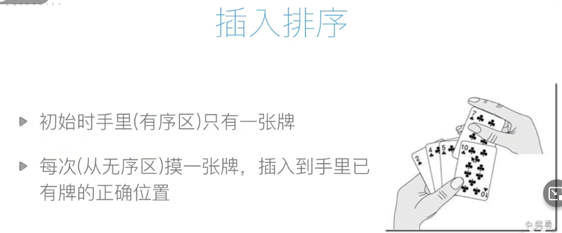
可以用摸扑克牌来理解这个过程：
手里一开始有一张牌（有序区初始数目为1），所以总数是n-1次，也即，摸n-1次牌就可以实现目标
不过
**算法怎么用具体的代码实现呢？**
```
def1是自己的尝试（错的离谱）
def2是标准代码
def3是自己尝试重新写
def cutin3(alist):
    for i in range(1, len(alist)):
        val = alist[i] #val是摸到的牌的下标
        j = i -1 #j是手里牌的下标
        #下面把摸到的牌在手里寻找合适的位置
        while(j >= 0 and val > alist[j]): #手里牌的下表不能小于0，即插入的顺序不可能为-1；然后另外一个条件是如果小于目前的值就交换
            alist[j],alist[j+1] = val, alist[j]
            j -= 1
    return alist
```
下面是第一次尝试和原作
```
def cutin1(alist):
    for i in range(1,len(alist)-1):#第一张：摸到的牌，后面的：每次摸到的牌
        j = i - 1 #j指的是手里的牌的下标志
        while(alist[i] > alist[j]):
            alist[0:0] = (alist[j],)  #只实现了插入功能，没有删去
            alist.remove(alist[j])
    return alist

def cutin2(alist):
    for i in range(1,len(alist)):#第一张：摸到的牌，后面的：每次摸到的牌
        tmp = alist[i]
        j = i - 1 #j指的是手里的牌的下标志
        #思考：这一段是如何实现的？？
        while(j >= 0 and alist[j] >tmp):
            alist[j+1] = alist[j]
            j -= 1
        #上面这段循环是在找插入的位置
        alist[j+1] = tmp
    return alist
```
*random模块的shuffle可以用于打乱
此时有时间应该要进行三种排序、两种查找的复习！
#4快速排序
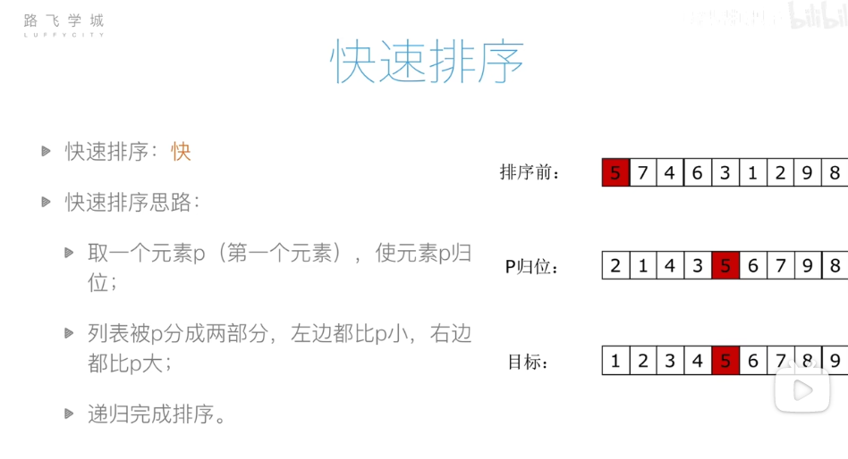