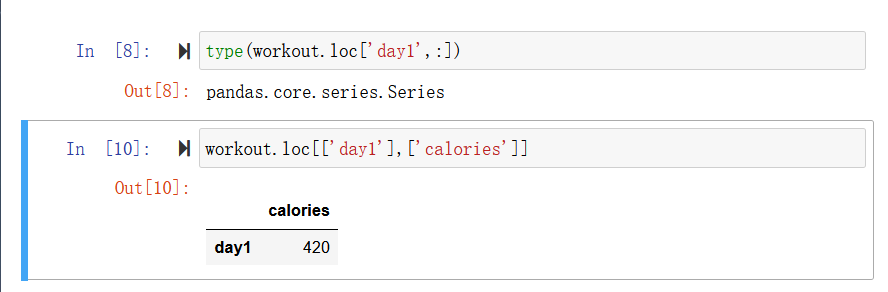
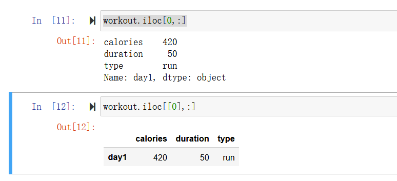
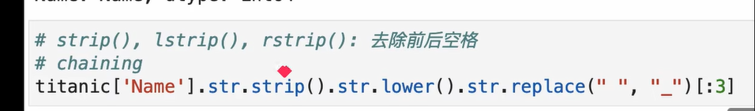
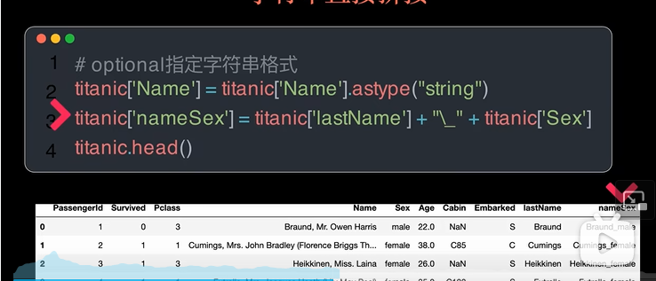

# pandas的基础操作

## **1.python 字典生成dataframe**

```python
import pandas as pd
import numpy as np
import matplotlib.pyplot as plt

workout_dict = {
"calories" : [420,380,390,390],
"duration" : [50,40,45,45],
"type" : ['run','walk','walk','run']
}

workout = pd.DataFrame(workout_dict)
display(workout)
```

*注意格式，这里的字典对应一个列表，且长度要一致*

## **2.行索引and列索引**

```python-repl
workout.columns.tolist() #输出列名的列表
workout.index.tolist() #输出所有行名的列表
workout = workout.rename(columns={"calories":"Cal"}) #单独改变某一列的列名
workout_dict = workout.to_dict() #转换回dict字典
```

## **3.行索引和列索引的指定**

```python-repl
#访问列
workout['calories']
#访问行(返回的是dataframe)
workout[['calories']]
```

## **4.四种选取数据的方法**

1. .loc
   先行后列，列名

   ```python
   workout.loc['day1',:]
   ```

   如果变成

   ```python
   workout.loc[['day'],:]
   ```

   会得到一个dataframe，上面得到的是series
   

   如果一个不加中括号得到的是series
2. .iloc
   先行后列，数字

   ```python
   workout.iloc[0,:]
   ```

   和上面一样，同理
   
3. .at
   .at用于选取一个数据

   ```python
   workout.at['day1','calories']
   ```

## **5.与list，dict，numpy的转化**

# 实际工作常用命令

## 1.外部数据读取

 pd.read...

## 2.通过打印预览

```python
df.head() #返回数据前五行

df.tail(10) #返回数据最后10行

df.sample(10) #任意返回10行数据
```


## 3.基本信息预览

看统计量

df.describe()

看数据类型

df.info()

看每一列的类型

df.dtypes

看series中所有出现过的值

df.unique()

## 4.统计性信息

### groupby()

```python
titanic.[['sex','Passengerld']].groupby(['Sex']).count()
```

    这段代码的意思是把sex和passenger拿出来做一个dataframe然后以sex来分组，并用count进行统计

### agg():一次性得到多种信息

可以对一个字段使用多种方法，如求平均值，求和等等

## 5.索引的设置

set_index和reset_index互为逆运算

# 工作流：字符串的处理

## 使用str预定义的函数



就是像基础中学的一样可以用str中的函数，不过要记得加加str

## 直接拼接



## 使用apply函数

和agg函数相似，不过apply函数可以使用自己自定义的函数

# 时间信息的处理

## pd.to_datetime()转换为时间格式


## timeDelta：时间差数据类型

## 序列中提供的一系列.dt时间函数（与.str函数很类似）
